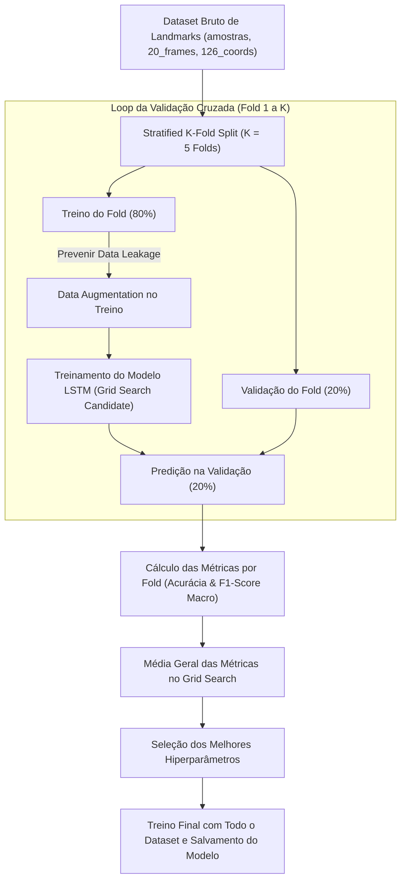

# Guia do Pipeline de Treinamento LSTM: Grid Search & K-Fold Cross-Validation

Este documento descreve a arquitetura, metodologia e implementação do pipeline avançado de treinamento, busca de hiperparâmetros (**Grid Search**) e validação cruzada (**Stratified K-Fold Cross-Validation**) para o modelo LSTM de tradução da Língua Brasileira de Sinais (Libras).

---

## 1. Visão Geral da Arquitetura

Para garantir robustez estatística, alta generalização e evitar sobreajuste (*overfitting*), o pipeline de avaliação do LSTM utiliza a seguinte estrutura:



---

## 2. Conceitos Fundamentais

### 2.1. Stratified K-Fold Cross-Validation (Validação Cruzada K-Fold Estratificada)
- **O que faz:** Divide o conjunto de dados em $K$ partições (Folds) mantendo a proporção de cada classe (sinal de Libras) em todas as dobras.
- **Por que utilizar:** Em datasets de Libras com número variável de amostras por gesto, a estratificação evita que algumas classes fiquem de fora da validação ou do treino durante os splits.
- **Prevenção de Data Leakage:** A **Data Augmentation** é aplicada **exclusivamente dentro de cada fold de treino**, nunca antes do split. Isso garante que amostras sintéticas derivadas do mesmo gesto nunca vazem para o conjunto de validação.

### 2.2. Grid Search (Busca em Grade de Hiperparâmetros)
O Grid Search testa sistematicamente combinações dos seguintes hiperparâmetros do modelo LSTM:

| Hiperparâmetro | Valores Testados (Exemplo) | Descrição |
| :--- | :--- | :--- |
| `units_1` | `[32, 64]` | Unidades da 1ª camada LSTM (retorna sequências) |
| `units_2` | `[64, 128]` | Unidades da 2ª camada LSTM |
| `dropout` | `[0.2, 0.3]` | Taxa de desativação aleatória de neurônios |
| `learning_rate` | `[0.001, 0.0005]` | Taxa de aprendizado do otimizador Adam |
| `batch_size` | `[8, 16]` | Tamanho dos lotes de treinamento |

### 2.3. Métricas de Avaliação

1. **Acurácia (Accuracy):**
   $$\text{Acurácia} = \frac{\text{Predições Corretas}}{\text{Total de Amostras}}$$
   Mede a proporção global de acertos do modelo.

2. **F1-Score Macro (F1-Macro):**
   $$\text{F1}_{\text{macro}} = \frac{1}{N} \sum_{i=1}^{N} \text{F1}_i$$
   Calcula a média não ponderada dos F1-scores de todas as classes. Essa métrica é essencial para garantir que o modelo performe bem em **todas** as classes, sem favorecer gestos com maior quantidade de dados.

---

## 3. Fluxo de Execução do Script `pipeline.py`

O script executável [`pipeline.py`](file:///home/fabricio/faculdade/8_periodo/TCC/tradutor-libras/pipeline.py) realiza o seguinte procedimento automático:

1. **Carregamento dos Dados:** Carrega as sequências 3D `(N, 20, 126)` diretamente do diretório `dataset/frames_treino` ou do arquivo CSV `dataset/dataset_completo_lstm.csv`.
2. **Definição da Grade de Hiperparâmetros:** Monta as combinações de parâmetros para o Grid Search.
3. **Execução do K-Fold:** Para cada combinação de hiperparâmetros:
   - Executa $K$ folds de treino e validação.
   - Aplica Data Augmentation no fold de treino.
   - Calcula os pesos de classe (*class weights*) para equilibrar o gradiente.
   - Treina o LSTM com Early Stopping.
   - Avalia Acurácia e F1-Macro no fold de validação.
4. **Consolidação dos Resultados:** Gera um relatório formatado e salva a tabela completa em `outputs/grid_search_results.csv`.
5. **Treinamento Final:** Seleciona a melhor combinação de hiperparâmetros (baseada no maior F1-Macro médio), treina o modelo final sobre o dataset completo e salva os artefatos:
   - Modelo: `models/lstm_sign_model.h5`
   - Label Encoder: `models/label_encoder.pkl`

---

## 4. Como Executar

Execute o pipeline diretamente via terminal:

```bash
python pipeline.py
```

### Parâmetros Configuráveis no Código:
* `K_FOLDS`: Número de partições da validação cruzada (Padrão: `5`).
* `EPOCHS`: Número máximo de épocas por treino (Padrão: `50` com Early Stopping).
* `PARAM_GRID`: Dicionário contendo os hiperparâmetros para busca.
